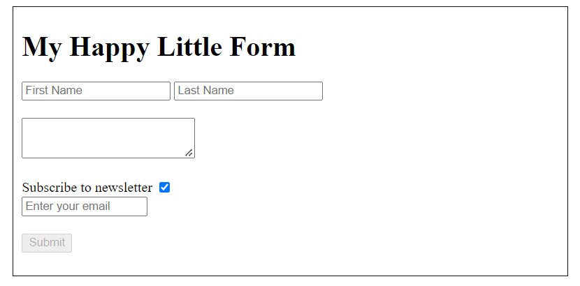
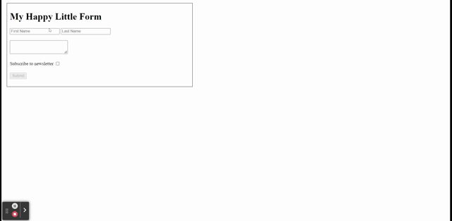

 

  

  <h2 align="center">Brian Denney No Framework Form Challenge</h3>

  

     
    <a href="https://abuna1985.github.io/brian-denney-form-challenge">View Demo</a>
  

## About The Project
 

  

 
This challenge was building a small and some features without leveraging a JavaScript framework.

Some features of note are:

* The form inputs have labels that are only visible to assistive technology (screen readers, etc)
* The submit button is enabled once the first & last name inputs are filled index
* When the subscription checkbox is checked, the email input field becomes visible
* When the form is submitted with a successful POST request:
  *  A success message is posted for 2 seconds
  *  All the inputs are reset and the submit button is disabled
*  An error message is shown when a POST request is not successful
   *  The inputs are kept the same
   *  A error message displays in the console

If you wan more information on the form challenge
* [Article - Brian Denney -The Framework Developer Test: Death by Form](https://typeshare.co/brianjenney/posts/the-framework-developer-test-death-by-form)
* [Google Docs - Form Challenge Instructions](https://docs.google.com/document/d/1zC4wts9HVIxBVdAdGrbk32-JEAbQh-orMGCMZE3sKAI/edit#heading=h.gwauynib8haa)

<a href="#top">back to top</a>

## Workflow/Roadmap

### Step 1

- [x] Create a new project with the following files
  - [x] index.html
  - [x] app.js
  - [x] index.css

- [x] Create a form in the `index.html` with the following fields
  - [x] Input with first name
  - [x] Input with last name
  - [x] Text area for comments
  - [x] Checkbox to subscribe to a newsletter
  - [x] Input for an email
  - [x] Submit button

### Step 2

- [x] Disable the submit button initially
- [x] The button should only be enabled if
  - [x] First name and last name have at least 1 letter in the text box
- [x] Hide the input for an email initially
- [x] The input for email should be displayed if
  - [x] The checkbox is checked

### Step 3

- [x] After clicking submit
  - [x] Make a POST request to https://jsonplaceholder.typicode.com/users
    - [x] The request object should follow this structure { firstName, lastName, isSubscribed, email, comment }
    - [x] The email property should only be sent IF they have checked the box to subscribe
    - [x] If the request is successful
      - [x] Display a success message that disappears after 2 seconds (e.g. ‘Thanks for your submission <FirstName>’
      - [x] Clear all form fields
    - [x] If the request is NOT successful
      - [x] Display a failure message (e.g. ‘Oops something went wrong’)
      - [x] Do NOT clear all fields

<a href="#top">back to top</a>

## Usage

  
Click here <strong>to see Step 1 Verification</strong>

  
There is an the following elements:

  <ul>
    <li>input for first name</li>
    <li>input for last name</li>
    <li>input for comments</li>
    <li>checkbox for subscribing</li>
    <li>input for email</li>
    <li>button for submitting form</li>
  </ul>
  

 

  
Click here <strong>to see Step 2 Verification</strong>

  
Submit button is only available when the first and last name inputs are filled in

  
The email input only shows when the subscription checkbox is checked

  

 

  
Click here <strong>to see Step 3 Verification with email</strong>

  
After the form is submitted:

  <ul>
    <li>A message is displayed for 2 seconds</li>
    <li>the form fields are emptied and submit button is disabled</li>
    <li>The form data with `email` and `isSubscribed` as true is seen in the request</li>
  </ul>
  

 

  
Click here <strong>to see Step 3 Verification with NO email</strong>

  
After the form is submitted:

  <ul>
    <li>A message is displayed in the form  under the submit button for 2 seconds</li>
    <li>the form fields are emptied and submit button is disabled</li>
    <li>The form data with `isSubscribed` as false is seen in the request</li>
  </ul>
  

 

  
Click here <strong>to see Step 3 Verification  failure scenario/success scenario</strong>

  <h4>Failure Scenario</h4>
  
First, In the `Network` tab of the console, I set `throttling` to `offline`

  
Then I filled in the form and submitted the form. I receive and error message in the form under the submit button and in the console.

  <h4>Success Scenario</h4>
  
In the `Network` tab of the console, I set `throttling` to `No throttling` so it can go back to online

  
After the form is submitted:

  <ul>
    <li>A message is displayed for 2 seconds</li>
    <li>the form fields are emptied and submit button is disabled</li>
    <li>The form data with `email` and `isSubscribed` as true is seen in the request</li>
  </ul>
  

 

<a href="#top">back to top</a>

## Credits
[Adam Abundis](https://adamabundis.xyz) ([@adamabundis](https://twitter.com/adamabundis)) 

<a href="#top">back to top</a>
## License

Distributed under the MIT License. See `LICENSE.txt` for more information.

<a href="#top">back to top</a>

## Acknowledgements

* [Article - Brian Denney -The Framework Developer Test: Death by Form](https://typeshare.co/brianjenney/posts/the-framework-developer-test-death-by-form)
* [Google Docs - Form Challenge Instructions](https://docs.google.com/document/d/1zC4wts9HVIxBVdAdGrbk32-JEAbQh-orMGCMZE3sKAI/edit#heading=h.gwauynib8haa)
* [JSON Placeholder API](https://jsonplaceholder.typicode.com/)
* [Go Make Things - How to show and hide elements with vanilla JavaScript](https://gomakethings.com/how-to-show-and-hide-elements-with-vanilla-javascript/)
* [Go Make Things - Listening for events on multiple elements using JavaScript event delegation](https://gomakethings.com/listening-for-events-on-multiple-elements-using-javascript-event-delegation/
)
[W3C - Labeling Controls](https://www.w3.org/WAI/tutorials/forms/labels/)
* <a target="_blank" href="https://icons8.com/icon/82791/form">Form</a> icon by <a target="_blank" href="https://icons8.com">Icons8</a>

<a href="#top">back to top</a>